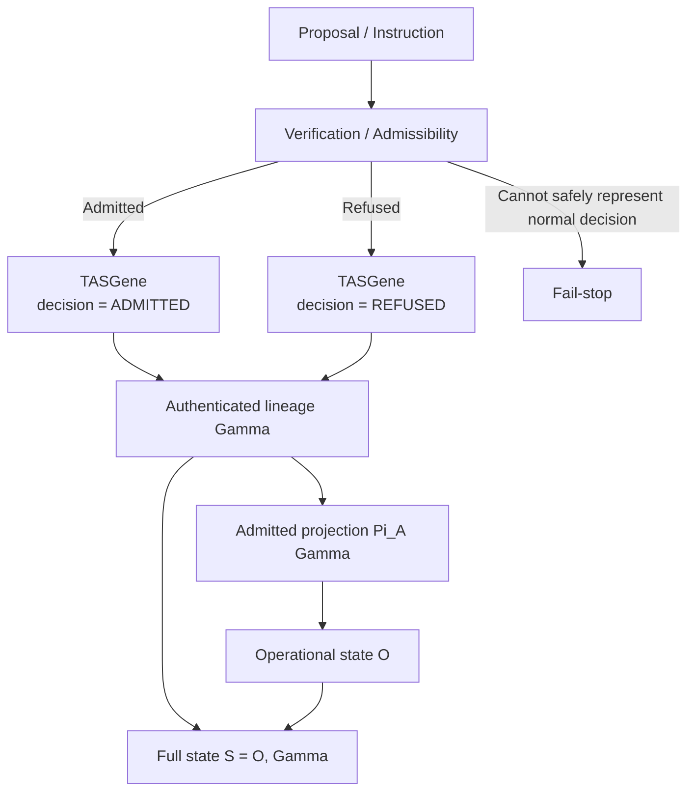
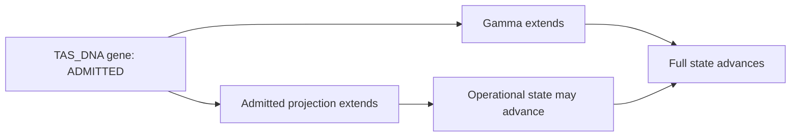
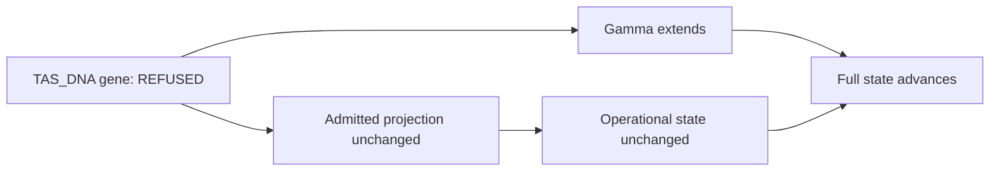

# TAS_DNA State Relation

## Admission

## Refusal

The refusal branch therefore satisfies both:

\[
O_{n+1}=O_n
\]

and

\[
S_{n+1}\neq S_n
\]

because the TAS_DNA datum extends authenticated lineage even though it does not enter the admitted projection.
