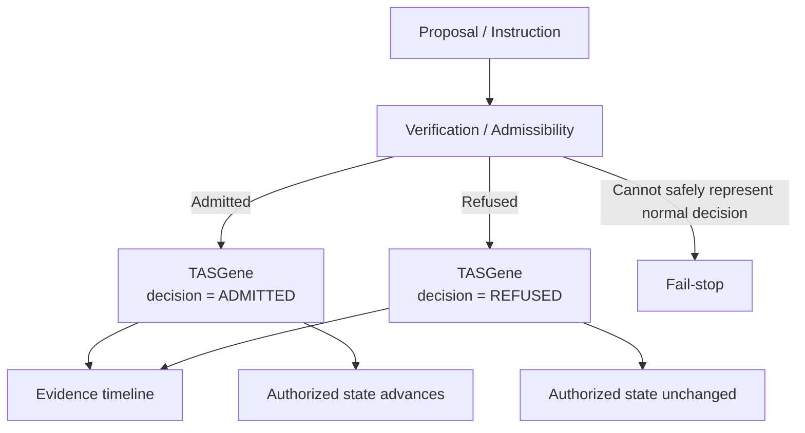
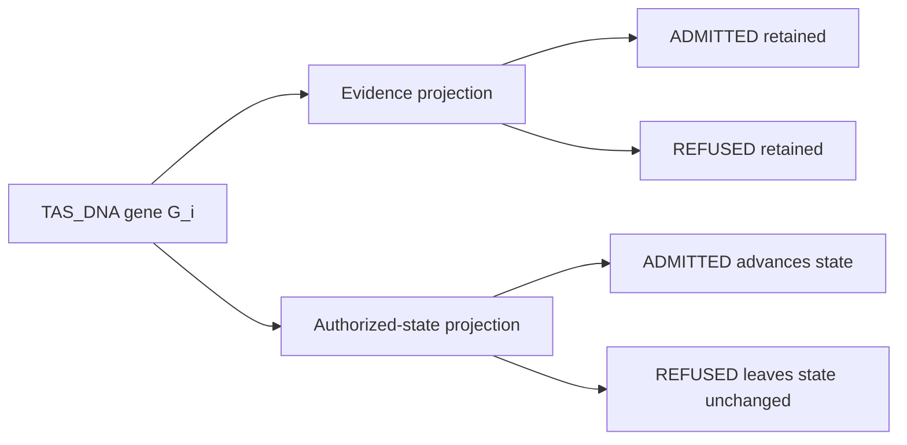

# TAS_DNA Transition Diagram

## One datum, two projections

The same TAS_DNA grammar is used in both branches. The decision field determines whether the datum contributes only to evidence or also advances authorized state.

Formally:

\[
G_i.d=\mathrm{ADMITTED}
\Rightarrow
\mathcal E_{n+1}=\mathcal E_n\Vert G_i
\land
S_{k+1}=F(S_k,G_i),
\]

while

\[
G_i.d=\mathrm{REFUSED}
\Rightarrow
\mathcal E_{n+1}=\mathcal E_n\Vert G_i
\land
S_{k+1}=S_k.
\]
