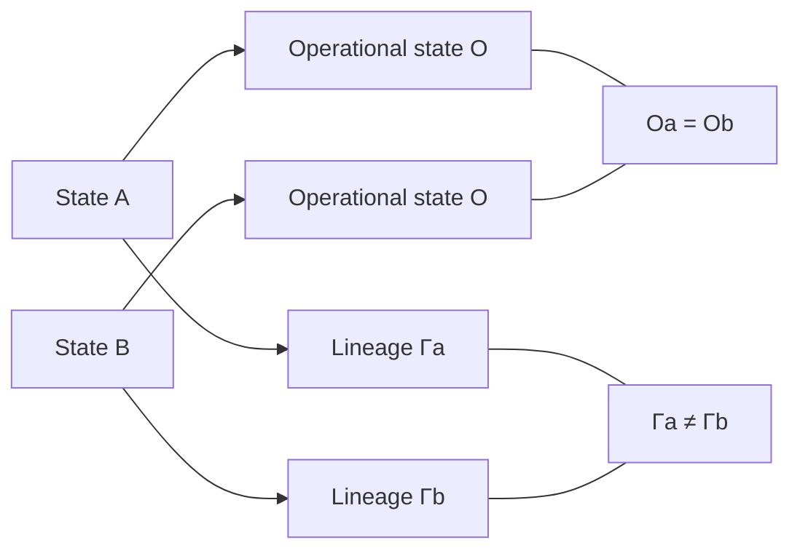

# State Transition Diagram

```mermaid
flowchart TD
    P[Proposal / Instruction] --> G[Admissibility Gate]
    G -->|All required predicates true| A[Admission]
    G -->|Predicate false| R[Refusal]
    G -->|Evaluation cannot be safely established| F[Fail-stop ⊥]

    A --> AO[Operational mutation: ΔO ≠ 0]
    A --> AG[Admission receipt: ΔΓ ≠ 0]

    R --> RO[Operational preservation: ΔO = 0]
    R --> RG[Refusal receipt: ΔΓ ≠ 0]

    AO --> AS[Successor state S' = (O', Γ')]
    AG --> AS
    RO --> RS[Successor state S' = (O, Γ')]
    RG --> RS
```

## Identity distinction



Even when the operational projections are equal, different authenticated trajectories imply different full states.
